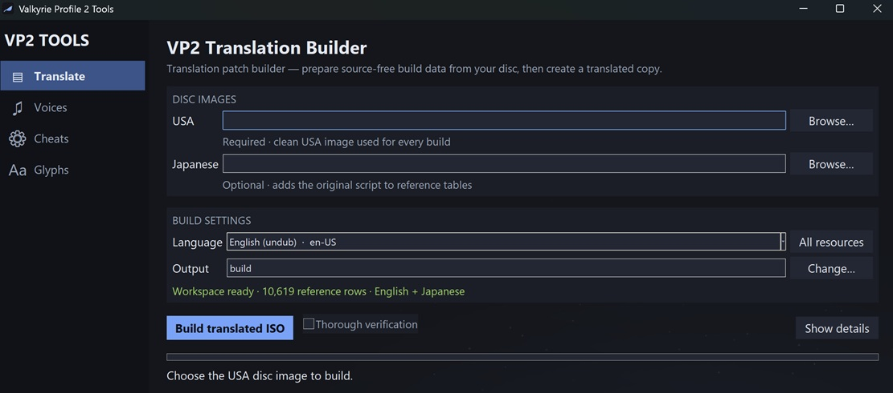

# Valkyrie Profile 2 Translations and Tools

Tools for _Valkyrie Profile 2: Silmeria_ on PlayStation 2. [Project Showcase](https://trulio2.github.io/Valkyrie-Profile-2-Tools/)

The downloadable **ValkyrieProfile2-Tools** application contains three tools:

- **Translate** builds a translated copy of the game.
- **Cheats** writes selected cheats into a copy of the game so they work
  without an emulator cheat file. It can create an ISO with the game's
  anti-cheat functions patched out.
- **Voices** extracts the English or Japanese voices and
  patches identified replacement WAV files into a copy of either release. It
  can also create a Japanese-audio edition of the USA and PAL releases.

The application never modifies a source disc image.



## Status

### pt-BR

Cutscenes: 100%\
NPC Dialogues: 100%\
Menus: 99%\
Images: 10%

### sv-SE

Cutscenes: 100%\
NPC Dialogues: 5%\
Menus: 1%\
Images: 0%

## Requirements

- A clean USA disc image (`SLUS_214.52`) for translation and cheats.
- A USA or Japanese disc image (`SLPM_664.19`) for voice extraction and
  replacement.
- A Japanese disc image plus a supported USA or PAL disc image to create a
  Japanese-audio edition.
- About 12 GB of free disk space for the source image, output image, and
  generated workspace.
- Optionally, a Japanese disc image (`SLPM_664.19`) if you want Japanese text
  in the translator's local reference files.

The downloadable Windows and Linux application includes its runtime and does
not require Python. Download the archive for your platform, unpack it, and
open `ValkyrieProfile2-Tools`. Its left sidebar switches between Translate,
Voices, and Cheats.

To run from source, install Python 3.11 or newer with pip and Tkinter/Tcl-Tk,
then run:

```bash
python -m pip install -r requirements.txt
```

There are currently no third-party Python packages to install. Tkinter comes
with standard Windows and macOS Python installations; Linux users may need to
install their distribution's Tk package. Check that it works with:

```bash
python -c "import tkinter; tkinter.Tcl()"
```

## Translator

Open `ValkyrieProfile2-Tools` and leave the default **Translate** page
selected. Choose your clean USA image and a language, then choose **Build
translated ISO**. The first build prepares a local workspace and takes longer;
later builds reuse it.

From a source checkout:

```bash
python vp2_tools.py
python vp2_translate.py build <usa-image.iso>
```

Portuguese (`pt-BR`) is selected when no language is specified. See the
[translator guide](docs/translator.md) for every command, output locations,
the optional Japanese reference, and language-pack usage.

### About the Game's Anti-Cheat

99.9% of the translation we're making does not trigger the game's anti cheat functions, but the script to add offsets to how the game finds texts inside images in battle do get caught by the anticheat. So, this leaves us with 3 options:

1. Give up on translating texts inside battle images.
2. Continue translating battle images, but make the texts in the translated images have identical positions and length,
   so changing offsets are not necessary.
3. Remove the anticheat functions directly from the translated iso, so it can't trigger regardless of the changes we make.

Options 3 is being used by default. The last step of the translation build patches the "disable-anti-cheat" directly the iso, so this new generated iso can have any offset changes or cheats enabled, and the anticheat will not trigger.

## Cheat Patcher

Open `ValkyrieProfile2-Tools`, select **Cheats** in the sidebar, choose your
clean USA image and cheats, then select **Patch ISO**. Only **Disable
Anti-Cheat Systems** is enabled by default.

From a source checkout:

```bash
python vp2_cheats.py <usa-image.iso>
python vp2_cheats.py <usa-image.iso> --patch angel-slayer
```

Passing an image without `--patch` applies every available cheat. Repeat
`--patch` to select more than one from the command line. See the
[cheat-patcher guide](docs/cheat-patcher.md) for the complete cheat list,
dependencies, output behavior, and safety checks.

## Voice Tool

Open `ValkyrieProfile2-Tools`, select **Voices** in the sidebar, and choose
either **Extract every voice** or a folder of replacement WAVs and **Patch
ISO**. To create an undub, open **Japanese Audio / Undub**, select the target
USA or PAL image and the Japanese image, then choose **Create Japanese-audio
ISO**. Source images are only read.

From a source checkout:

```bash
python vp2_voices.py extract <usa-or-japan-image.iso>
python vp2_voices.py patch <base-image.iso> <replacement-wav-folder>
python vp2_voices.py import-japanese <usa-or-pal-image.iso> <japan-image.iso>
```

Extraction creates `voices/en/` or `voices/jp/`. See the [voice-tool
guide](docs/voices.md) for the reversible file names, cutscene folders, WAV
requirements, and legacy dub-kit compatibility.

## Documentation

- [Translator guide](docs/translator.md)
- [Cheat-patcher guide](docs/cheat-patcher.md)
- [Voice-tool guide](docs/voices.md)
- [Translation-pack format](docs/translation-format.md)
- [Drawing new glyphs](docs/authoring-glyphs.md)
- [Known issues](docs/issues.md)
- [Contributing](docs/CONTRIBUTING.md)

## License and game data

The project is licensed under `GPL-3.0-only`. See
[LICENSE-SCOPE.md](legal/LICENSE-SCOPE.md) for what the license covers.

The repository and release archives contain no game data. You must provide
your own legally obtained disc image.
